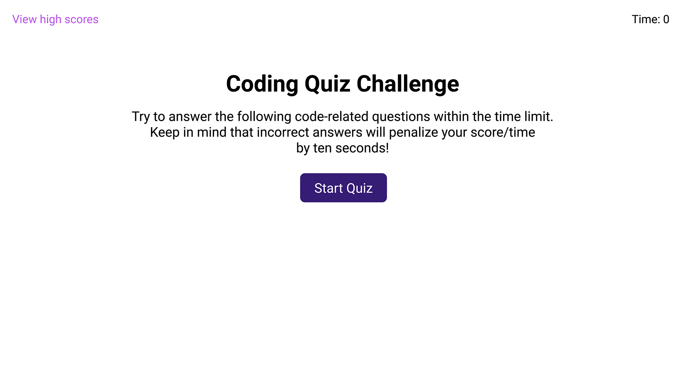
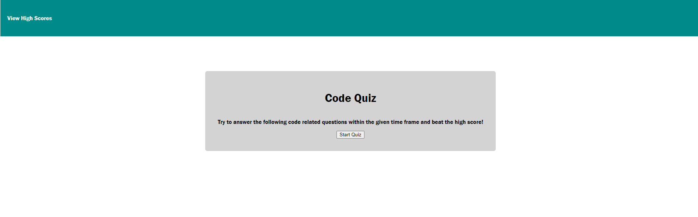

# Code-Quiz

## Module 2 Challenge - Code Quiz

This challenge requires the student to create a timed, online coding assessment involving a combination of multiple-choice questions.   
This app will run in the browser, and will feature dynamically updated HTML and CSS  
powered by JavaScript code that the student writes.  
The finished product will have a clean, polished, and responsive user interface. 

## User Story

AS A coding bootcamp student.  
I WANT to take a timed quiz on JavaScript fundamentals that stores high scores.  
SO THAT I can gauge my progress compared to my peers.  

## Acceptance Criteria

GIVEN I am taking a code quiz  
WHEN I click the start button  
THEN a timer starts and I am presented with a question  
WHEN I answer a question  
THEN I am presented with another question  
WHEN I answer a question incorrectly  
THEN time is subtracted from the clock  
WHEN all questions are answered or the timer reaches 0  
THEN the game is over  
WHEN the game is over  
THEN I can save my initials and score  

## Mock Up

## Deployed Application

https://andylaborde.github.io/Code-Quiz/

## Credits

N/A

## License

Please refer to the LICENSE on the repo.
